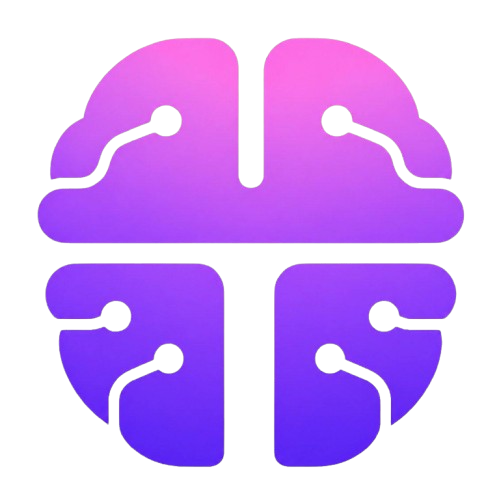

<div align="center">
  

  <h1>
    <span>TOK</span><span>AI</span>
  </h1>

  <p><strong>BCI × AI · Focus-Based To-Do List &amp; Task Management — built for ADHD brains</strong></p>
  <p><strong>腦機介面 × AI · 專注導向待辦清單與任務管理 — 為 ADHD 大腦打造</strong></p>

  <p><em>A productivity app that reads your live cognitive state and plans your day around how your brain is actually performing.</em></p>

  <p>
    <a href="https://tokai-pre-alpha-tokai.vercel.app/"></a>
    <a href="https://tokai.app"></a>
    <a href="https://github.com/TokaiApp/Tokai/blob/main/LICENSE"></a>
    
    
  </p>

  <p>
    <a href="https://tokai-pre-alpha-tokai.vercel.app/">Try it live →</a>
  </p>
</div>

---

## Overview 概述

**Tokai** is an open-source, neurosupportive productivity app built for neurodivergent brains — especially people with ADHD. It pairs a real-time neural dashboard with an AI assistant and a focus-aware task manager, so you can plan your day around how your brain is *actually* performing, not how you wish it were.

**Tokai** 是一款專為神經多樣性大腦（尤其是 ADHD 患者）打造的開源、神經支持型生產力應用程式。它結合即時神經儀表板、AI 助手與專注感知任務管理器，協助你依據大腦的「實際」表現規劃一天，而非盲目硬撐。

> To the best of our knowledge, **Tokai is the first app in the world** to propose an AI task planner and agentic to-do list — **TokAgent** and **TokDo** — driven by the user's own brain data.
>
> 據我們所知，**Tokai 是全球首款**提議根據使用者大腦數據來驅動 AI 任務規劃器與代理型待辦清單（TokAgent 與 TokDo）的應用程式。

Neural data is **simulated** in this alpha release. Integration with [Muse 2](https://choosemuse.com/) and other consumer EEG headsets is planned for future versions.

目前的 Alpha 版本中，神經數據為**模擬狀態**。計劃在未來版本中整合 [Muse 2](https://choosemuse.com/) 及其他消費級 EEG 設備。

---

## Features 核心功能

Everything is themed as the **Tok** family — the prefix nods to *token* (the app currency, **TokEn**) and the first syllable of *Tokai*.

| | English | 中文 |
|---|---|---|
| 🧠 | **Real-time neural dashboard** — a horizontally-scrollable row of live metric cards (Focus Index, Bio Energy, Neural Noise, Theta/Beta Ratio, Focus Window, Working Memory Load, Mental Fatigue, Hyperfocus Risk), updating every second with on-edge scroll arrows and fade hints | **即時神經儀表板** — 可左右捲動的即時指標卡列（專注指數、生理能量、神經噪訊、θ/β 比值、專注窗口、工作記憶負荷、心理疲勞、過度專注風險），每秒更新，含邊緣捲動箭頭與漸層提示 |
| 📈 | **Focus Stream** — a scrollable real-time line chart with side scroll arrows, a LIVE pill, and reference lines for the 5-minute, session, and day averages; medication and journal markers are overlaid on the timeline | **專注串流** — 可捲動的即時折線圖，含側邊箭頭、LIVE 按鈕，以及 5 分鐘／本次／當日均值參考線；時間軸上疊加用藥與日誌標記 |
| 🤖 | **TokAgent** — a Claude-powered assistant in a slide-up **bottom dock**. Reads your live neural metrics, full task list, journal, and meds to give context-aware planning advice. Per-day sessions, persisted history. Uses a server key or your own | **TokAgent** — 由 Claude 驅動的助手，置於可滑出的**底部面板**。整合即時神經指標、任務清單、日誌與用藥，提供情境感知規劃建議。按日分組、保存對話。可用伺服器金鑰或自備金鑰 |
| ✅ | **TokDo** — a focus-aware task manager: pick an **Active Task** and TokAgent recommends what you *should* be doing right now (confirm or switch). Numbered, **drag-to-reorder** list (▲/▼ on mobile), per-task **Focus Required** (0–100) with readiness badges, emoji, estimates, deadlines, and a detail modal | **TokDo** — 專注感知任務管理器：選擇**進行中任務**，TokAgent 即建議你此刻**應該**做什麼（確認或切換）。可編號、**拖曳排序**清單（行動裝置用 ▲/▼），每項任務含**所需專注度**（0–100）與就緒徽章、表情、預估與截止日 |
| ⏱ | **TokTimer** — a Pomodoro timer tied to your brain data: links sessions to your Active Task, suggests an early break when focus drops and an extend when you're in flow, logs completed blocks, with presets (25/5 · 50/10 · 90/20), auto-continue, a chime, a browser-tab countdown, and an always-visible header chip while running | **TokTimer** — 與腦部數據連動的番茄鐘：將時段連結到進行中任務，專注下降時建議提早休息、心流時建議延長，記錄完成時段；含預設、自動接續、提示音、瀏覽器分頁倒數，以及執行中常駐標頭計時器 |
| 💡 | **TokInsights** — automatic, on-device observations from your own history: when you focus best, which moods track your focus, task completion, where your focus time goes, and more. No API calls — instant and private | **TokInsights** — 根據你自身歷史在本機自動計算的觀察：你何時最專注、哪些情緒對應高專注、任務完成度、專注時間花在哪等。不呼叫 API — 即時且私密 |
| 📓 | **TokNote** — an ADHD-friendly journal with multi-select mood tagging, each entry auto-stamped with date, time, and your Focus Index at that moment | **TokNote** — ADHD 友善日誌，支援多選情緒標籤，每則條目自動標記日期、時間與當下專注指數 |
| 💊 | **TokMed** — log medications, supplements, and stimulants; Tokai tracks how your Focus Index shifts in the 15–30 minutes after each entry | **TokMed** — 記錄藥物、補充品與咖啡因；Tokai 追蹤記錄後 15–30 分鐘內專注指數的變化 |
| 🔔 | **Notifications** — focus-drop alerts, recovery banners, medication reminders, and TokTimer phase changes | **通知** — 專注下降提醒、恢復橫幅、用藥提醒與 TokTimer 階段切換 |
| 🪙 | **Profiles & TokEn** — Supabase-backed accounts with an AI-generated profile summary, BCI device selection, subscription tiers, and the TokEn currency | **個人檔案與 TokEn** — 由 Supabase 支援的帳戶，含 AI 生成的個人摘要、BCI 裝置選擇、訂閱方案與 TokEn 代幣 |
| 📅 | **Day selector** — browse any past day; TokNote, TokAgent, and TokDo are filtered per selected day (past days are read-only) | **日期選擇器** — 瀏覽任一歷史日期；TokNote、TokAgent 與 TokDo 均按所選日期篩選（歷史日期唯讀） |
| 🀄 | **Bilingual** — full English and Traditional Chinese (繁體中文) across every panel | **雙語支援** — 所有面板完整支援英文與繁體中文 |
| 📱 | **Responsive** — three-column desktop layout (sidebar · dashboard · TokDo) with a swipeable widget row on mobile | **響應式設計** — 桌機三欄（側欄 · 儀表板 · TokDo），行動裝置採可滑動的小工具列 |

---

## Live Demo 立即體驗

**[https://tokai-pre-alpha-tokai.vercel.app/](https://tokai-pre-alpha-tokai.vercel.app/)**

> AI features (TokAgent, the TokDo recommendation, the AI profile summary) run on a server-side Anthropic key when configured. You can also bring your own key in the UI — it's stored locally in your browser and never saved on Tokai's own servers.
>
> AI 功能（TokAgent、TokDo 建議、AI 個人摘要）在已設定時使用伺服器端的 Anthropic 金鑰；你也可在介面中自備金鑰，金鑰僅儲存在你的瀏覽器本機，不會儲存在 Tokai 的伺服器上。

---

## Tech Stack

| Layer | Technology |
|---|---|
| Frontend | React 18, TypeScript, Vite |
| Charts | Recharts |
| Icons | Lucide React |
| Fonts | Share Tech Mono, Rajdhani, Inter (Google Fonts) |
| Auth & Database | [Supabase](https://supabase.com) (Postgres + Auth + Row-Level Security) |
| AI | [Anthropic Claude](https://anthropic.com) — Haiku 4.5 (fast planning) and Sonnet (chat / vision) |
| API Server | Node.js, Express 5 (stateless relay) |
| Monorepo | pnpm workspaces |
| Deployment | Vercel (frontend + serverless API) |

---

## Architecture

```
Tokai/
├── artifacts/
│   ├── tokai/                      # React/Vite frontend
│   │   ├── src/
│   │   │   ├── pages/
│   │   │   │   └── dashboard.tsx       # Main dashboard (metrics, TokDo, TokTimer, TokInsights…)
│   │   │   ├── components/
│   │   │   │   └── agent-chat.tsx      # TokAgent chat UI (rendered in the bottom dock)
│   │   │   └── lib/
│   │   │       └── supabase.ts         # Supabase client
│   │   ├── migrations/                 # One-off SQL to run in the Supabase SQL editor
│   │   ├── public/tokai_logo.png
│   │   └── vite.config.ts              # Dev proxy: /api → API server
│   └── api-server/                 # Express API (serverless on Vercel) — stateless relay
│       └── api/
│           └── index.js               # /api/chat, /api/best-task, /api/generate-profile,
│                                       # /api/generate-description, /api/mood-check
├── lib/db/                         # Shared DB types/tooling
├── pnpm-workspace.yaml
└── README.md
```

The frontend talks directly to Supabase for user data, and proxies `/api` AI requests to the Express relay in development. In production, `VITE_API_BASE_URL` points to the deployed Vercel serverless function.

---

## Getting Started

### Prerequisites

- [Node.js](https://nodejs.org/) v18+
- [pnpm](https://pnpm.io/) v10+
- A [Supabase](https://supabase.com) project (free tier is fine)
- An [Anthropic API key](https://console.anthropic.com) (server-side, or bring-your-own in the UI)

### 1. Clone & install

```bash
git clone https://github.com/TokaiApp/Tokai.git
cd Tokai
pnpm install
```

### 2. Set up Supabase

Create a project, then run the SQL files in `artifacts/tokai/migrations/` (in date order) in the **Supabase SQL editor**. These create/extend the `tasks`, `profiles`, and `focus_sessions` tables and their Row-Level Security policies. (You'll also need the base `tasks`, `profiles`, `journal_entries`, and `med_log` tables with per-user RLS.)

### 3. Configure environment variables

**Frontend** — `artifacts/tokai/.env.local`:
```env
VITE_SUPABASE_URL=https://<your-project>.supabase.co
VITE_SUPABASE_ANON_KEY=<your-anon-key>
# Leave empty for local dev (Vite proxy handles /api routing)
VITE_API_BASE_URL=
```

**API server** — `artifacts/api-server/.env`:
```env
# Server-side key used when a user hasn't provided their own
ANTHROPIC_API_KEY=sk-ant-...
```

### 4. Run the dev servers

In two terminals:

```bash
# Terminal 1 — API server (port 3000)
PORT=3000 pnpm --filter @workspace/api-server dev

# Terminal 2 — Frontend (port 5173)
pnpm --filter @workspace/tokai dev
```

Open [http://localhost:5173](http://localhost:5173).

---

## Deployment

Deploys as two Vercel projects plus a Supabase project.

### Supabase
Run the migrations in `artifacts/tokai/migrations/` and confirm RLS is enabled on every user table.

### Frontend (`artifacts/tokai/`)
1. Import as a Vercel project; framework preset **Vite**
2. Env vars: `VITE_SUPABASE_URL`, `VITE_SUPABASE_ANON_KEY`, and `VITE_API_BASE_URL` → your API server URL

### API Server (`artifacts/api-server/`)
1. Import as a separate Vercel project (the `vercel.json` configures the serverless function)
2. Add `ANTHROPIC_API_KEY` (users can also supply their own key in the UI)

---

## Neural Metrics Explained

| Metric | Description |
|---|---|
| **Focus Index** | Composite score (0–100) derived from EEG theta/beta patterns |
| **Bio Energy** | Simulated biological energy level (%) — will reflect HRV/biometrics in future versions |
| **Neural Noise** | Background EEG signal noise (μV²) — lower is cleaner; higher means distraction or arousal |
| **Theta/Beta Ratio** | Elevated TBR (>3.0) is associated with ADHD inattention |
| **Focus Window** | Predicted time remaining in your current focus state, from the recent trend |
| **Working Memory Load** | Estimated load on working memory |
| **Mental Fatigue** | Estimated cognitive fatigue building over the session |
| **Hyperfocus Risk** | Likelihood you're locking into hyperfocus (and may skip breaks/meals) |

TokAgent and the TokDo recommendation use these to tailor advice:
- **High focus (>70):** deep work, complex problem-solving, demanding tasks
- **Moderate focus (40–70):** structured tasks, planning, communication, reviewing
- **Low focus (<40):** easy wins, breaks, movement, admin tasks

---

## Data Privacy & Neuroprivacy

Brain data is among the most sensitive data a person can produce. Tokai is built to keep each user's data isolated and under their control.

### Where your data lives

- **Supabase (Postgres, per-user via Row-Level Security):** tasks (incl. order and your Active Task), journal entries, medications, profile + AI summary, and TokTimer focus sessions. RLS ensures a user can only read and write their own rows.
- **Browser `localStorage` (device-local):** your Anthropic API key (if you bring your own), TokAgent chat history, the live focus-stream samples, and TokTimer settings.
- **Sent to Anthropic** (via the stateless API relay, per request only): your current neural metrics, task list, journal, med log, and the conversation / active task. **TokInsights is computed entirely on-device and sends nothing.**

### Stateless relay

Tokai's API server is a stateless relay: it receives an AI request, forwards it to Anthropic, and returns the response — it stores nothing.

### Anthropic's no-training policy

Anthropic explicitly does not use API customer data to train its models — a documented commitment that distinguishes the API from consumer products. See [Anthropic's privacy policy](https://www.anthropic.com/privacy).

### Open-source auditability

The full source — including the API relay and the exact system prompts sent to Claude — is in this repository. There are no hidden data flows.

### Alignment with the NeuroRights Foundation's Five Ethical Neurorights

| Neuroright | Tokai's implementation |
|---|---|
| **Mental Privacy** | Per-user data isolation via Supabase RLS; local-only API keys and chat; Anthropic's no-training API policy; open-source auditability |
| **Personal Identity** | No writing to the brain; TokAgent is strictly advisory and cannot alter your state or identity |
| **Free Will / Agency** | TokAgent's recommendation is advisory — you choose your Active Task and every task action requires explicit input |
| **Fair Access** | Web-based, open source, bring-your-own-key option (free Anthropic tier), bilingual (EN / 繁中) |
| **Algorithmic Bias Protection** | No demographic data collected; recommendations based solely on your own metrics; system prompts are publicly auditable |

### Known limitations

- **Shared devices:** `localStorage` is device-local and unencrypted; use a private browser profile on shared machines.
- **Backend trust:** user data is stored in the deployer's Supabase project. RLS isolates users from each other, but the deployer/operator controls the database.
- **Real EEG (future):** raw EEG is far more sensitive than the simulated values used today; the privacy architecture will be re-evaluated when hardware integration ships.
- **Anthropic dependency:** AI data handling is governed by Anthropic's privacy policy for the duration of each API call.

---

## Roadmap

- [x] **User accounts** — Supabase auth, cross-device sync for tasks, ordering, and focus sessions
- [x] **Focus session tracking** — TokTimer sessions feeding TokInsights
- [ ] **Real EEG integration** — Muse 2, OpenBCI, Neurosity
- [ ] **Focus-aware scheduling** — plan the day against your focus curve; optional Google Calendar sync
- [ ] **Metered AI / free tier** — wire the TokEn currency to real AI usage
- [ ] **ADHD-specific profiles** — personalized thresholds and recommendations
- [ ] **Mobile app** — native iOS/Android with EEG Bluetooth pairing
- [ ] **HRV & biometric integration** — Apple Watch, Fitbit, Garmin
- [ ] **LUNA integration** — binary classification model for ADHD detection (research phase)

---

## Research Context

Tokai originated as a master's thesis project exploring the intersection of real-time neurofeedback, agentic AI, and ADHD management. The core hypothesis: **if an AI assistant has access to a user's live cognitive state, it can dramatically improve task-planning outcomes for people with executive-function challenges.**

This repository is the first public alpha (v0.2.0-alpha). We are actively seeking collaborators, researchers, and neurodivergent users willing to provide feedback.

---

## Contributing

We welcome contributions — especially from people with ADHD or neurodiversity research backgrounds.

1. Fork the repository
2. Create a feature branch: `git checkout -b feature/your-feature`
3. Commit your changes
4. Open a pull request

For significant changes, please open an issue first to discuss the approach.

**Feedback and bug reports:** [GitHub Issues](https://github.com/TokaiApp/Tokai/issues)

We especially want to hear from people who have tried the app. If you have ADHD, your experience matters most — this is built for you.
我們特別期待 ADHD 使用者的回饋，這款產品正是為你們而打造的。

---

## About 關於

**Tokai — Theory of Knowledge, Amplified Intelligence.**
**Tokai — 知識理論，增強智能。**

Learn more about the project and team at **[tokai.app](https://tokai.app)**.

---

## License

Copyright © 2026 TokaiApp

Licensed under the [Apache License, Version 2.0](LICENSE).

You may use, modify, and distribute this software freely under the terms of the Apache 2.0 License. See the [LICENSE](LICENSE) file for details.

---

## Acknowledgments

- [Anthropic](https://anthropic.com) — Claude AI powering TokAgent
- [Supabase](https://supabase.com) — auth and database
- [Recharts](https://recharts.org) — charting library
- [Lucide](https://lucide.dev) — icons
- The ADHD and neurodiversity community — for inspiring this work
